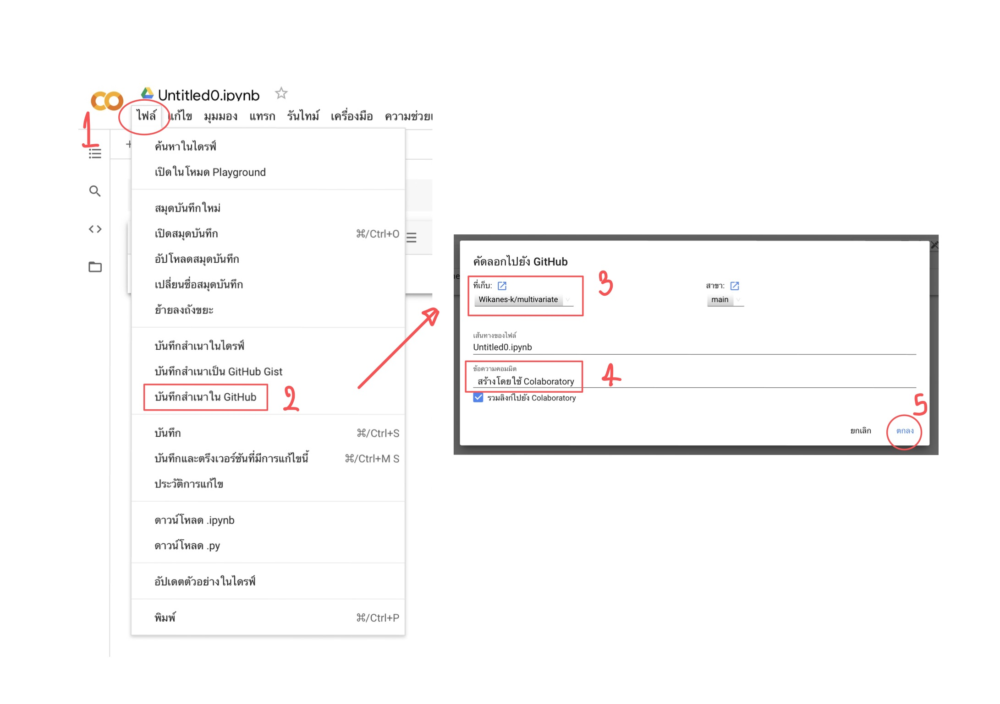

# multivariate

## วิฆเนศ เกียรติเกษมสุข 623021055-6

.md => markdown
[] square brackets
() parentheses

อธิบายการใช้งาน Github และ Google Colab ว่าหน้าที่ของแต่ละอันคืออะไร และอธิบายวิธีเซฟไฟล์จาก Google Colab ลงใน Github

### Github
หน้าที่ คือ เป็นเว็บไซต์ที่ช่วยเก็บรักษาไฟล์และรวบรวมไฟล์ ทั้งยังแจกจ่ายให้คนอื่นๆสามารถเห็นได้ด้วย โดยไม่ต้องเสียเงิน

### Google Colab
หน้าที่ คือ เป็นเว็บไซ์ที่เปิดให้คนทั่วไปเขียนโค้ด Python ได้ฟรีผ่าน Google Chrome Browser

### อธิบายวิธีเซฟไฟล์จาก Google Colab ลงใน Github
คือ ต้องล็อกอินGithubให้พร้อม แล้วทำตามดังนี้

1.กด ไฟล์ ->
2.เลือกคำสั่ง บันทึกสำเนาใน GitHub ->
3.เลือกที่เก็บ ->
4.ใส่ข้อความคอมมิต ->
5.กดตกลง

